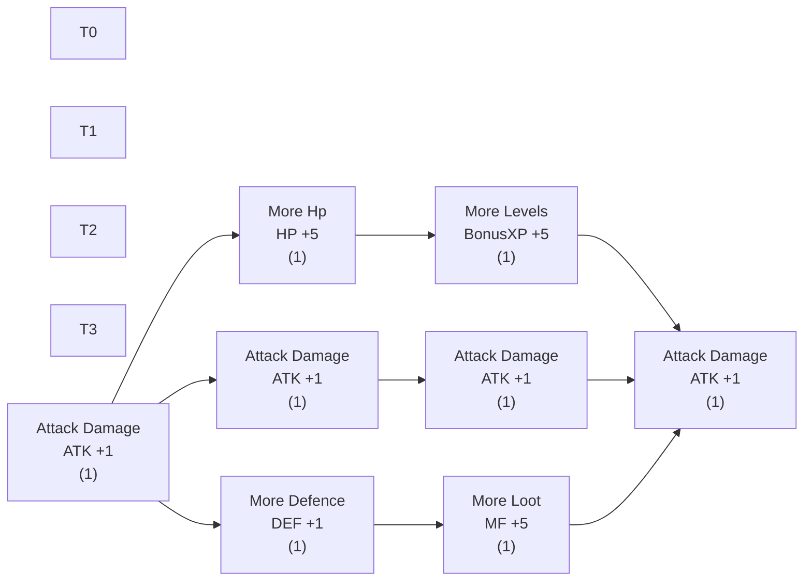
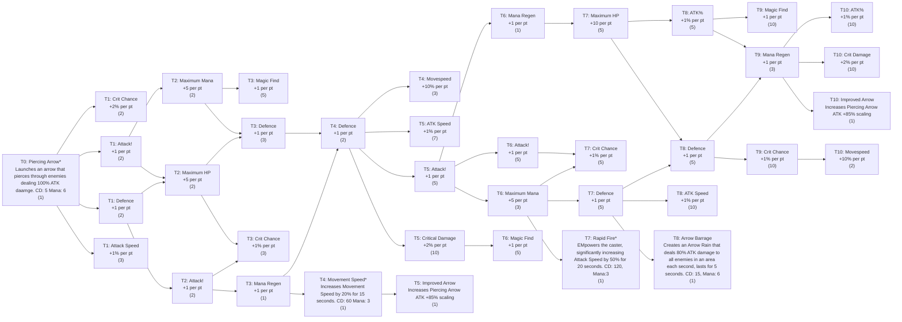
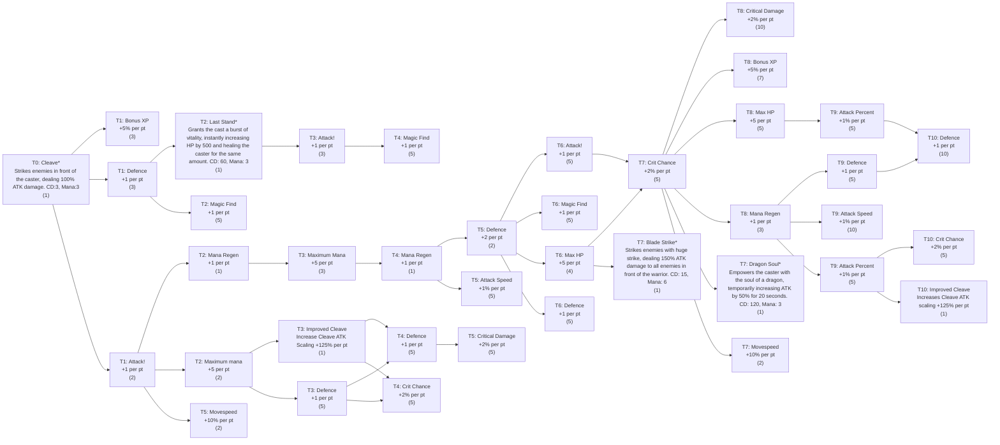
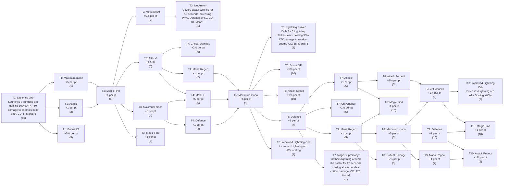

# Talent Tree Review

Please correct any errors below. Nodes marked with `*` are active skills. Numbers in parentheses are max points.

Each tier flows left-to-right. Nodes within a tier are listed top-to-bottom.

---

## Novice (shared, all classes) Novice only has 3 columns, if a row only has 1 column it should be centered, for example T0_0 should be at the same horizontal position as T1_1 which is the middle of the tree

**Total: 8 nodes**

---

## Rogue

---

## Warrior

---

## Mage

---

## Ash Tree (Act 2 Bonfire)

This is what we currently have in `ash-upgrades.json`. Please correct everything — order, names, effects, max ranks, connections, and costs.

**Cost note:** The save file doesn't store ash costs, so I can't extract them. For nodes you've already bought, write "cost: ?" and we'll fill in later. For unpurchased nodes, record the ash cost shown in-game.

```mermaid
graph LR
    T0_0["T0: Attack Increase<br/>+30% per pt<br/>(1) cost: ?"]

    T1_0["T1: Fuel Efficiency<br/>-5% consumption per pt<br/>(3) cost: ?"]
    T1_1["T1: Attack Increase<br/>+30% per pt<br/>(1) cost: ?"]
    T1_2["T1: Smeltery Speed<br/>+10% per pt<br/>(1) cost: ?"]

    T2_0["T2: Maximum Fuel<br/>+10000 capacity<br/>(1) cost: ?"]
    T2_1["T2: More Ash<br/>+15% ash odds per pt<br/>(3) cost: ?"]
    T2_2["T2: Fiery Defence<br/>+5 phys def per pt<br/>(4) cost: ?"]
    T2_3["T2: Hunter Cost Reduction<br/>-50% hunter costs per pt<br/>(5) cost: ?"]

    T3_0["T3: Crit Damage<br/>+10% crit dmg per pt<br/>(3) cost: ?"]
    T3_1["T3: Ash Discount<br/>-10% ash costs<br/>(1) cost: ?"]
    T3_2["T3: Smeltery Speed<br/>+10% per pt<br/>(1) cost: ?"]
    T3_3["T3: Movespeed<br/>+5% per pt<br/>(2) cost: ?"]

    T4_0["T4: Crit Chance<br/>+1% crit chance per pt<br/>(4) cost: ?"]
    T4_1["T4: Rune Overload<br/>Runes stack in inventory<br/>(1) cost: ?"]

    T5_0["T5: Defence Increase<br/>+5% phys def per pt<br/>(5) cost: ?"]
    T5_1["T5: Attack Increase<br/>+30% per pt<br/>(1) cost: ?"]

    T6_0["T6: Fuel Efficiency<br/>-5% consumption per pt<br/>(3) cost: ?"]
    T6_1["T6: More Ash<br/>+15% ash odds per pt<br/>(3) cost: ?"]

    T7_0["T7: Attack Increase<br/>+30% per pt<br/>(1) cost: ?"]
    T7_1["T7: More Ash<br/>+15% ash odds per pt<br/>(3) cost: ?"]

    T8_0["T8: Maximum Fuel<br/>+10000 capacity<br/>(6) cost: ?"]
    T8_1["T8: Smeltery Speed<br/>+10% per pt<br/>(3) cost: ?"]

    T9_0["T9: Auto Runes<br/>Runes auto-enter inventory<br/>(1) cost: ?"]

    T10_0["T10: Smeltery Speed<br/>+7% per pt<br/>(4) cost: ?"]

    T0_0 --> T1_0 & T1_1 & T1_2
    T1_0 --> T2_0
    T1_1 --> T2_1 & T2_2
    T1_2 --> T2_3
    T2_0 --> T3_0
    T2_1 --> T3_0
    T2_2 --> T3_0
    T2_3 --> T3_3
    T3_0 --> T4_0 & T4_1 & T3_1
    T3_1 --> T3_2
    T4_0 --> T5_0 & T5_1
    T5_0 --> T6_0
    T5_1 --> T6_1
    T6_0 --> T7_0
    T6_1 --> T7_1
    T7_0 --> T8_0
    T7_1 --> T8_0 & T8_1
    T8_1 --> T9_0
    T9_0 --> T10_0
```

**Total: 16 nodes across 6 rows**

**What to correct:**
- Node names, effects, max ranks
- Add/remove/reorder nodes
- Fix connections (I guessed 1-to-1 down each column — probably wrong)
- Add ash cost per rank where you can see it

---

## How to correct

Edit this file and:
1. Add/remove/move nodes to the correct tier
2. Fix stat names or maxPoints values
3. Fix skill names
4. Note any connection patterns that aren't "all nodes in prev tier connect to all in next tier"

Save and tell me when done — I'll reingest into talents.json.
